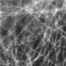
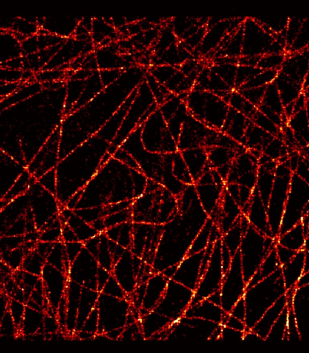

# cuda-smlm
A single molecule localization microscopy algorithm supporting the cuda computation. The localization algorithm is done by maximum likelihood estimation optimized by Levenberg–Marquardt algorithm.
To run the code, please install the pytorch (GPU version).
The output localization data is stored in a csv file and can be rendered by SMAP

## Diffraction limit image

## SMLM image

